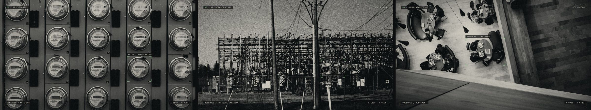
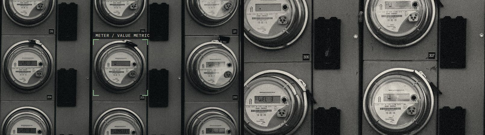
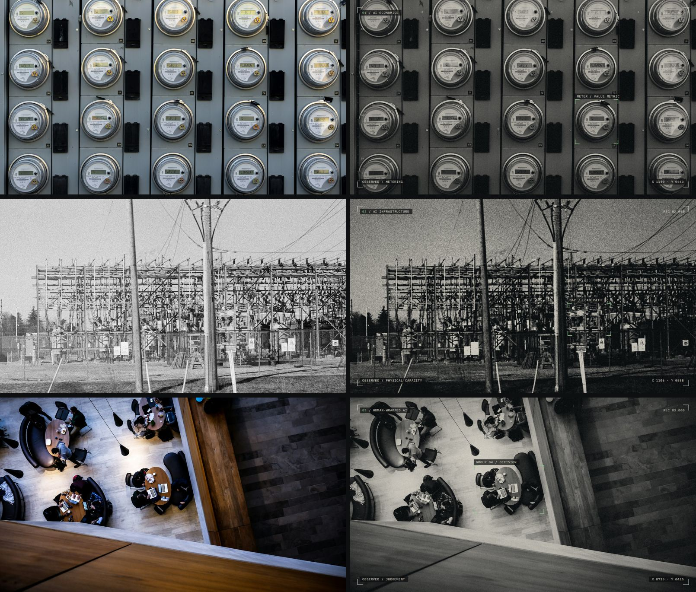
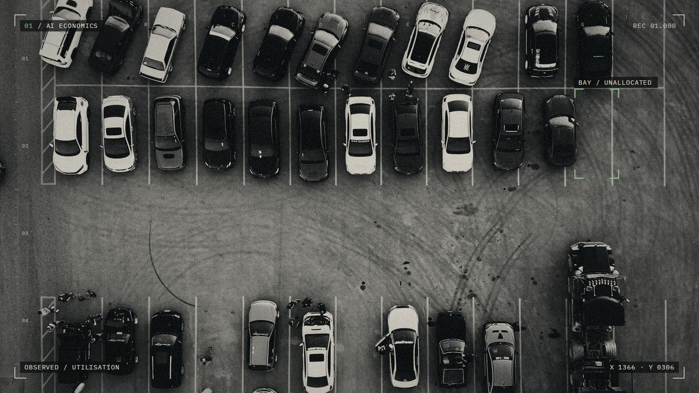
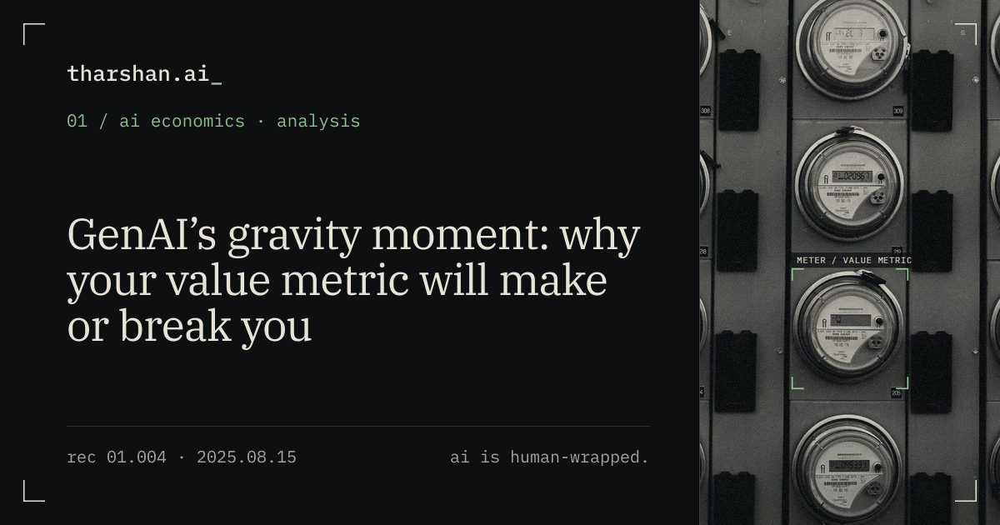

# tharshan.ai visual system

> tharshan.ai is a human editorial archive viewed through a machine interface.
> The interface provides the grammar. The subjects provide the imagery. The writing provides the humanity. The archive keeps its history.

This document covers **imagery**: the subject images, covers, video artwork, share images, and how historical article media is handled. The interface grammar (type, colour, navigation, metadata) is in [`DESIGN.md`](../DESIGN.md).



## 1. The one rule

**The subject changes. The observer does not.**

Each subject differs from the others only in *what is being observed*: its subject matter, its vocabulary and its one selected object. Colour, tone, grain, framing, type and marker grammar are identical across all three. **No subject has a colour of its own.**

| Subject | Observed | Image | The one selected object |
| --- | --- | --- | --- |
| 01 / AI Economics | metering | A wall of identical electricity meters | One meter: `meter / value metric` |
| 02 / AI Infrastructure | physical capacity | An electrical substation at ground level | One equipment bay: `bay / load path` |
| 03 / Human-Wrapped AI | judgement | People at tables, seen from far above | One group: `group 04 / decision` |

Why metering for AI Economics: a bank of identical units, one of them selected, covers pricing, value metrics, unit economics, margins and usage-based cost without becoming a trading floor, a stock chart or a logistics photo. It sits close to infrastructure economics without becoming another data centre.

## 2. When to use an image, and when not to

Images are **optional**. The identity must work without them: type, metadata and framing are enough on their own. Every image slot on the site has a typographic fallback (see §9).

Add an image only when it adds editorial meaning. Do **not** add one when:

- it would only illustrate the title literally (a data centre for a data-centre piece, a chart for a pricing piece);
- the piece is short, a note, or reads better without it;
- it is Research: research pages use document framing only, no imagery;
- the only available photo breaks the sourcing rules in §8.

**Category decides the world. The article decides the subject.** An infrastructure essay about hyperscaler CapEx is about obligations rolling downhill, not about a building. Interpret the argument.

## 3. Formats and crops

| Asset | Size | Where it's used | Made by |
| --- | --- | --- | --- |
| Key image (master) | 1600 × 900 (16:9) | Topic page header, article cover | `tools/visuals/make.py` |
| Fragment | 800 × 450 crop around the selected object | Homepage subject rows (desktop only) | `make.py` |
| Artwork | 960 × 540 crop of the *treated photo, no overlay* | Behind the video record on topic pages | `make.py` |
| Article share strip | 360 × 630 centred on the selected object (or the cover's centre) | Open Graph, articles | `src/lib/og.ts` at build |
| Topic share strip | 500 × 630 centred on the selected object | Open Graph, topic pages | `src/lib/og.ts` at build |

Crop rules:

- Compose the master so the selected object sits away from the frame corners, which hold metadata. Keep it out of the outer 120 px on every side.
- The selected object must survive the 800 × 450 fragment crop and a 360 px-wide vertical strip.
- Mobile shows the master full width, below the page introduction, never above it.
- The artwork crop must not contain the bracket or labels. It is texture behind a title, not a fake still from a video.



## 4. Treatment (stage 1, identical for every image)



1. **Crop** to 16:9 at the source's full resolution, then resize to 1600 × 900.
2. **Noise floor.** Bring a grainy source down to a common floor (median filter) *before* the house grain is added. That's how a film photo and a clean drone photo end up matching.
3. **Monochrome.** Rec. 709 luminance, then clip the 1st and 99.3rd percentiles.
4. **Exposure.** Normalise every image to the same median brightness (0.36), so no subject is brighter than another.
5. **Tone.** A gentle S-curve.
6. **Colour.** Map black to `#0d0f10` (the page) and white to a warm off-white `rgb(226 221 210)`. No other colour exists in a subject image.
7. **Grain.** Monochrome Gaussian grain, σ = 7.5 (0–255 scale), fixed seed.
8. **Vignette.** Soft, to 28% at the corners.

Lighting and subject: daylight or even interior light, documentary, unposed. From above or at a distance. Large repeating structures (rows, grids, bays, tables) suit the selection grammar best.

## 5. The observation layer (stage 2)

Drawn on top of the treated photo by `make.py`, in this order:

- **Frame corners**: off-white, 1.5 px, 26 px long, inset 34 px.
- **Edge rulers**: a tick every 40 px along the top and left edges; longer every 200 px.
- **One subject trace** in off-white, faint, in the subject's own vocabulary:
  - economics: a ledger-like index (A, B, C… along the top; 01, 02… down the side)
  - infrastructure: a measured span along the structure
  - human-wrapped AI: dotted links between the groups
- **One acquisition bracket**: signal green (`#8fbf8f`), 2.5 px, 20 px corners, 6 px outside the selected object, with a short label in green on a dark tab. **Exactly one per image.** Everything else stays off-white.
- **Metadata at fixed positions** (IBM Plex Mono, 15 px, uppercase, +0.06em):
  - top left: `01 / ai economics` (index in green)
  - top right: `rec 01.000`
  - bottom left: `observed / metering`
  - bottom right: `x 1140 · y 0563`, the selected object's position in frame pixels. Never invented geography, never invented statistics.

**Vocabulary ceiling.** The words used in images and on the site are: *subject, record / rec, selected record, observed, unit names (meter, bay, group), unaltered, original media, artwork*. Don't add terms. No show references, no invented system language, no fake readouts. If a label wouldn't be understood without decoding, drop it.

## 6. Article covers

Covers are optional and rare. Add one in the article's frontmatter:

```yaml
cover:
  src: "./images/my-cover.jpg"      # a 1600×900 image made with tools/visuals/make.py
  alt: "What the image shows, plainly."
  caption: "the value metric"        # optional, the observed idea in a few words
  addedLater: true                   # set when the cover was made after the article was first published
```

`addedLater: true` adds the caption "new cover · not part of the original article", so readers can always tell the current interface from the historical piece underneath it.

**Future direction (not used yet): the car park.** An aerial car park with one empty bay selected (`bay / unallocated`, observed: utilisation) is the reserved visual for pieces about CapEx, commitments, idle capacity and utilisation: capacity paid for and not used. Its source is already recorded in `tools/visuals/SOURCES.md` (`future-car-park.jpg`).



## 7. Historical media (non-negotiable)

**The shell is new. The artefact is not.**

Everything that was inside an article when it was written (memes, screenshots, GIFs, charts, diagrams, rough graphics) stays exactly as published:

- never replaced, redrawn, recoloured, restyled, filtered, cropped or removed;
- never run through this pipeline;
- the original file is served (re-encoding for delivery is allowed only at full resolution, as already approved).

At build time, `src/lib/artefacts.ts` wraps each original image in a labelled frame, *original media · as published 2025.08.15 · unaltered*. It moves the `` element and changes nothing about it. An old article is meant to look like an artefact from its time, catalogued by the current interface.

One grandfathered exception: the WRAP quadrant in *Wrapping your head around aGeNtiC aI* was redrawn natively during migration, with the author's approval. It is the only exception and sets no precedent.

**Preservation check.** After any design change, compare the source files with the recorded fingerprints and confirm the files the site serves are unchanged:

```bash
sha256sum public/images/writing/* src/content/writing/images/*
```

## 8. Sourcing

- Record every photo in `tools/visuals/SOURCES.md` (photographer, URL, licence, date) **before** using it.
- Licences must allow commercial use with modification (Unsplash Licence, CC0, public domain, or your own photos).
- No visible brands or logos, no readable personal data, no close-up faces, no posed people.
- No generated "AI imagery", no humanoid robots, no holograms, no stock-market or crypto clichés.

## 9. Image-optional fallbacks

| Slot | With an image | Without |
| --- | --- | --- |
| Topic header | Two columns: text and master image, caption `observed / last record` | One column, with an `observed / last record` line under the introduction |
| Homepage subject rows | A small viewport onto the fragment (desktop) | `explore →` |
| Video record | Subject artwork behind the typographic record, labelled `artwork: …` | The typographic record alone |
| Article | Cover above the body | Title, dek, byline and record block only |
| Share image | Strip of the subject image or cover | Typographic card |

Remove a subject's `visual` entry in `src/lib/topics.ts` and every slot falls back automatically.

## 10. Share images

Generated at build time by `src/lib/og.ts` (1200 × 630):

- **Article**: frame corners; `01 / ai economics · analysis` in green; serif title; `rec 01.004 · 2025.08.15`. A 360 px strip of the cover, or of the subject image centred on its selected object, on the right.
- **Topic**: the same layout with a wider 500 px strip and the topic's descriptor.
- **Research**: typographic only, with the document number, journal, year and authors.
- **Default**: typographic, "AI is human-wrapped."



## 11. Making a new image

> "Create an image for this new AI Infrastructure essay."

1. Read the essay. Write one sentence on what the argument is about, which is not the same as its topic.
2. Find a photograph of a structure in the subject's world where *one* element can carry that argument. Check §8 and add it to `SOURCES.md`.
3. Add an entry to `COVERS` in `make.py` (`src`, `crop`, `box` for the selected object, `label`, `observed`, `trace`, `n`, `title`) and run `python3 tools/visuals/make.py`. The cover is written to `src/content/writing/images/`.
4. Check it next to the three subject images. If it looks like it came from a different system, the crop, exposure or subject is wrong. Fix that; never change the treatment.
5. Add it as the article's `cover` with an honest `alt`.
