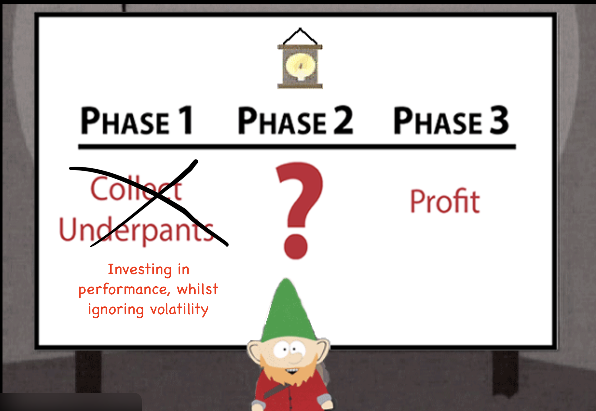

AI compute market is transitioning from today’s fragmented, multi-party ecosystem toward vertically integrated stacks controlled by hyperscalers. This transition is driven less by performance (benchmarks are still a thing people seem to be talking about religiously) and more by the need to stabilise cost, pricing, and supply.

We are well beyond this being a model race or being stuck with this as a stock call. We find ourselves at the ever-familiar infrastructure and capital-cycle story.

<figure></figure>

At the closing stages of 2025 AI demand is very real, and it will persist well into 2026. But once this rocket-ship growth begins to level out and normalise, capital discipline will return. Volatility will become visible. Unit economics will be interrogated. This does not require an AI “winter” (even though I thought the first wind of that should have hit our industry by now). A growth slowdown alone is sufficient to expose assumptions that only hold in expansionary eras/regimes.

Before markets reprice AI compute, operators are forced to. Volatility first appears in gross margin compression, cash-flow unpredictability, and cost-to-serve inflation. What was once treated as a flexible operating expense increasingly behaves like a governed financial liability, demanding forecasting, guardrails, and accountability. This dynamic has been captured empirically in the debut *[Cost of Cloud Compute Index](https://www.cloudcapital.co/the-cost-of-compute).*

## Volatility is the core constraint<del>, performance never was</del>

Public debate has centred around (flawed) benchmark performance and hardware throughout. This misses AI compute’s binding constraint.

Volatile compute creates systemic friction. It prevents hyperscalers from normalising margins, discourages customers from embedding AI into core workflows, and turns long-dated contracts/commits into risk rather than reassurance. As long as pricing remains unstable, AI cannot behave like infrastructure. It remains a speculative cost centre rather than a dependable utility.

Removing volatility, not maximising pEaK bEnChMaRk PeRfOrMaNcE, becomes the primary strategic objective. The winners will be those who absorb uncertainty across time, geography, and demand cycles, and repackage compute as a predictable, governable service.

## Where value consolidates

As compute commoditises, economic value consolidates into two places:

1. the infrastructure layer, where volatility can be absorbed
2. application layers embedding judgement, workflow, and accountability

Intermediary positions that cannot absorb volatility face sustained margin compression.

This is a classic capital-cycle behaviour. Supply-side gluttony precedes demand failure. Markets reward spending itself long before durable returns are proven, and tend to reprice mid-cycle, often before spending slows or utilisation stalls/declines.

AI compute does not behave like traditional industrial capital. It is closer to a probabilistic, option-like asset whose value depends on workload economics rather than physical utilisation. GAAP can be followed. Disclosures can be complete. Assumptions can still fail!

## tl;dr

AI demand will not go away in 2026.

But building/backing positions whose economics only function in high-volatility, high-growth environments is a risk the market has seen before time and time again.
