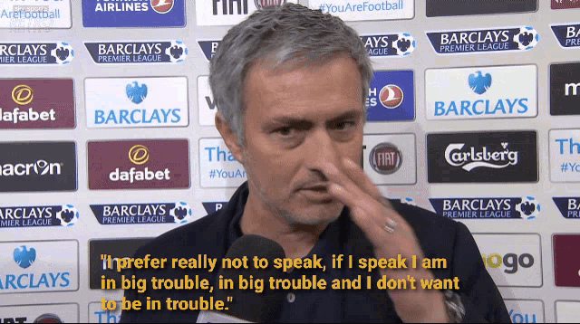

The media calling Lovable a “vibe coding unicorn” is proper misleading.\
It might describe who they serve. It does not describe how they got there.

Lovable’s monster $200m Series A at a $1.8b valuation is a massive European win, a yuge Swedish win:

- 2.3m+ users
- 180k+ PAID subscriptions
- $75m+ arr
- <50 employees

All that in less than a year = properly nuts.

Even Karpathy, who coined “vibe coding” earlier in the year, has recently walked back its long-term viability. Because vibe coding does not scale. AI-generated code introduces bugs, security risks, and technical debt. Based on the reality of today’s AI, it is just not suited for maintaining or extending real products.

And yet, the media and these aI iNfLuEnCeRs keep pushing the narrative that Lovable is a proof point of vibe coding’s potential. Let’s be clear: it itself is not a vibe-coded product.

What Lovable actually is (from my non-technical perspective):

- extensive directory of technical templates (frontend skins, backend logic, database models, auth scaffolds, integrations etc)
- provide a natural-language prompt, and it returns the next-best template stack to fit your requirements
- chains through a structure flow: content to UI to backend to deployment to integrations

= this wasn’t built as a vibe-coded side project. This is real AI-assisted software engineering, with composability, scaffolding, and scale baked in.

**So why the narrative inflation?**

Feels like an intentional push to keep “vibe coding” hype alive - even though the model doesn't hold up under scale, because of the technical limitations of today’s iteration of AI. We’ve seen this pattern: 2021-2023. 2008. The dotcom crash.\
As an industry, we refuse to learn.

For absence of doubt - huge huge congratulations to the Lovable team. I wish I were on that cap table, alongside such a high-functioning, high-leverage team. Execution is unreal.

But let’s not mistake the outcome: this isn’t a win for vibe coding.\
It’s the tippest of all hats in how structure, templates, and smart abstraction can scale.
